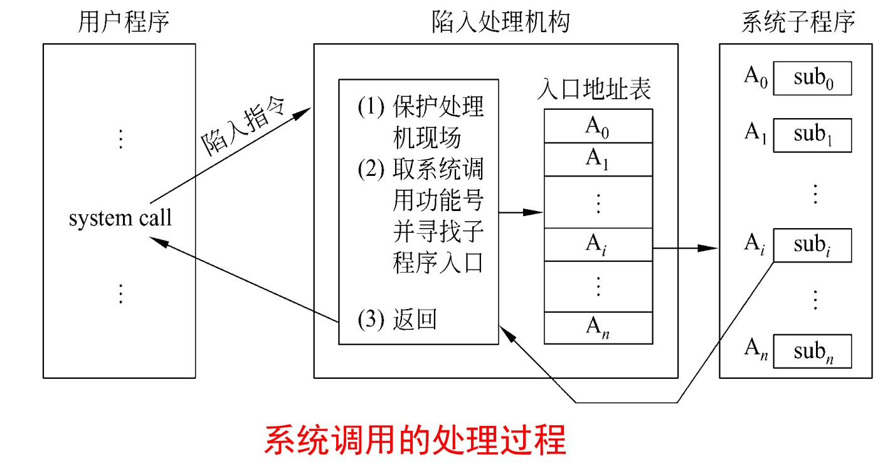

### 1.1操作系统特性
#### 1.并发性
多个程序从宏观上同时运行
>并发性与并行性不同在实际运行上（微观）
a.并发性从宏观上是同时运行的，但微观实际上是交替进行，即一个处理器在几个进程之中跳转，如果速度够快看上去就如同这几个同时运行；
b.并行性则强调微观运行上确实有多个设备资源，如两个处理器同时运行，处理器和硬盘同时运行
#### 2.共享性
各个程序共用系统的各种软硬件资源，
并经由操作系统控制和调控
#### 3.程序异步性
宏观上虽然多程序同时运行，但实际是交替运行的，并且交替点为中断（中断随机发生，意味着切换不可预知确定）
>程序和进程的不同：
如果将程序和其运行环境和数据结合来说，则是进程，不然就是一般的程序，即一段代码（或说机器码）
#### 4. 虚拟性
通过映射的方式将物理实体变为几个逻辑实体
如将一个实际CPU通过某种标准看作几个CPU来使用
或把外存如硬盘看作是RAM的一部分编址使用

### 1.2操作系统运行环境
>即操作系统必要的硬件支持等
#### 1.定时装置
a.绝对时钟
>记录实际时间，相当于整个系统共用的统一时间标准，不中断，由电源和电池供电;一般只读取，可通过特权修改

b.间隔时钟
>作为计时器用（单位一般为ms），定时发生中断(如溢出中断)，这个中断保证操作系统能获得控制权（其他中断也会进入操作系统，但不稳定），是多道程序的基础

#### 2.堆和栈
每个运行程序都有一个堆和两个栈（一个用户栈，一个系统栈）

a.堆
>属于用户空间，由操作系统动态分配，运行时超出存储则中断让操作系统为其扩充空间

b.栈
主要用于保存调用的返回点，参数，局部变量，返回值
>虽然保存的内容类型相近，但用户栈保存的是单个程序之中的各个函数的相互调用的各项数据，而系统栈保存的则是各个子程序之间的调用的相关信息

调用操作系统参数传递：
长的参数如字符串一般只能通过用户栈传递
短的参数则可以通过系统栈和寄存器传递（返回值也可以通过寄存器传递）

#### 3.寄存器
硬件需提供一套寄存器供运行进程使用
>a.程序状态字(PSW)
用于保存程序状态即运行环境的寄存器
b.指令计数器(PC)
记录保存运行程序的下一条指令地址
c.栈指针(SP)
管态和目态各有一个，分别保存系统栈和用户栈的栈顶位置
d.通用寄存器和浮点寄存器
用于存数和计算，还可以用用于保存系统调用时传递给操作系统的参数以及由操作系统传给用户的返回值
e.地址映射寄存器
一般有一对，分别记录内存区域的起始地址和长度，分别叫基址寄存器(base)和限长寄存器(limit)

#### 4.特权和非特权指令
现代计算机指令系统由特权和非特权指令集组成
>a.特权指令
只能在管态下执行的指令，一般是会影响整个系统的指令，如开关中断，一般只能由操作系统执行
b.非特权指令
管态和目态都可以执行的指令，通常是只与运行程序本身有关的指令，如数据传送和算术运算等
#### 5.处理器状态及状态转换
硬件至少要区分两种状态：管态和目态，由一位触发器标识，往往作为程序状态字的一部分（其中的一位标识）
>a.管态
也称系统态，核心态
拥有全部指令
b.目态
也称用户态
拥有非特权指令

管态可以通过特权指令修改程序状态字中的一位标识进入目态，对应操作系统到用户程序的转换
而目态进入管态的唯一途径便是中断，这个过程一般是通过操作系统初始化程序来设置的
#### 6.地址映射机构
因为多道程序的内存存放位置往往是随机确定，并且可变动的，所以一般用逻辑地址，而该机构便负责将逻辑地址转换为内存物理地址
#### 7.存储保护设施
用于防止某些程序的错误/恶意地址侵犯其他程序的空间或一些非法存储操作如越界等
#### 8.中断装置
中断装置一般有两个功能
>a.发现中断：识别中断事件并按优先级响应
b.响应中断：将目前运行进程的中断向量PSW和PC压入系统栈，后根据中断原因到指定的内存单元将新的中断向量取出放入寄存器中，从而跳转到对应的中断处理程序
#### 9.通道与DMA控制器
硬件通过某些设备处理I/O
>a.通道是专门负责管理输入输出的处理器，增加了设备并行度，有自己的指令系统
b.DMA虽然与通道相似，但受CPU委托而没有自己专门的指令系统，而且一般一次只能传输一个数据块(不可编程)
#### 10.I/O保护
定义所有的I/O指令为特权指令
方便使用，防止冲突

### 1.3操作系统界面形式
>操作系统实现了对计算机硬件的虚拟化封装，使得用户无需直接接触硬件，而是通过操作系统使用硬件；
而用户和操作系统之间的界面形式目前主要有5种：
* 作业控制语言
>批处理系统的界面形式;
通过一种语言(job control language,JCL)和操作系统交流，对想执行的作业作出说明书，系统会根据其说明书和其提供的程序和数据处理作业
* 系统调用命令
>将系统视作一个程序，通过应用程序接口(application program interface,API)的方式调用系统，在用户程序执行中使用系统调用命令时发生自愿性中断,保存断点后通过陷入指令进入陷入处理机构，根据调用的内容从入口地址表找到对应的系统子程序执行后返回 
* 交互终端命令(即命令行，command line,cmd)
>系统为交互终端用户提供一组交互式命令,是分时操作系统所具有的界面形式。
通常由操作系统内核的命令解释程序提供s
但UNIX系统则由非核心的shell(外壳)提供
* 图形用户界面(GUI)
>本质上也属于交互式界面，如Windows等
* 触屏用户命令
>通过感应式接触屏幕接受用户的触摸和手的姿势产生的中断，从而与操作系统交互
